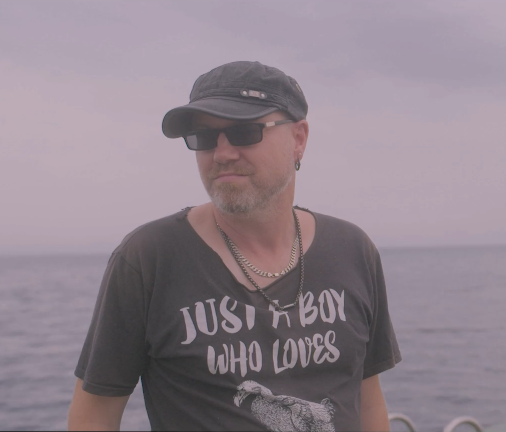
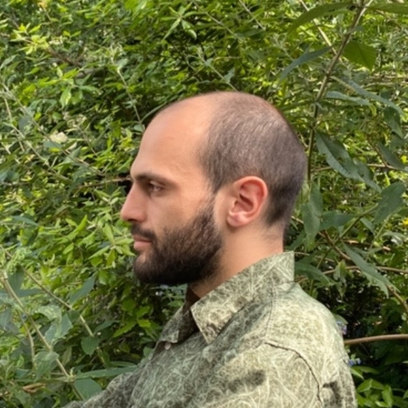

# People

We have a 25 year track record in diagrammatic reasoning for foundations of physics, quantum computing, linguistics and cognitive science.
Our [Quantum Group](https://www.cs.ox.ac.uk/activities/quantum/) at the University of Oxford pioneered the field of [categorical quantum mechanics](https://en.wikipedia.org/wiki/Categorical_quantum_mechanics) (CQM), a high-level description of quantum protocols, and the [ZX-calculus](https://en.wikipedia.org/wiki/ZX-calculus), a complete graphical language for qubits.

Categorical distributional compositional ([DisCoCat](https://en.wikipedia.org/wiki/DisCoCat)) models are the application of CQM to linguistics, this led to our development of [quantum natural language processing](https://en.wikipedia.org/wiki/Quantum_natural_language_processing) (QNLP) where we performed the first NLP experiment on quantum hardware.
In the process we developed open source software: [lambeq](https://github.com/Quantinuum/lambeq) for experimental QNLP and [DisCoPy](https://discopy.org/), the fundamental package for computing with [string diagrams](https://en.wikipedia.org/wiki/String_diagram) in Python.

  

    
    <a href="https://en.wikipedia.org/wiki/Bob_Coecke" class="name">Bob Coecke</a>
    CEO
  

  

    
    <a href="https://www.linkedin.com/in/destiny-chen-manager" class="name">Destiny Chen</a>
    COO
  

  

    
    <a href="https://scholar.google.com/citations?user=-_bkN1gAAAAJ&hl=en" class="name">Giovanni de Felice</a>
    CSO
  

  

    
    <a href="http://alexis.toumi.xyz/" class="name">Alexis Toumi</a>
    CTO
  

  

    
    <a href="https://scholar.google.com/citations?user=fG9vZC4AAAAJ" class="name">Tommaso Salvatori</a>
    Head of ML
  

Interested in what we do? Contribute to our open source projects, [join us](careers) or write to `contact@rel-int.ai`.
